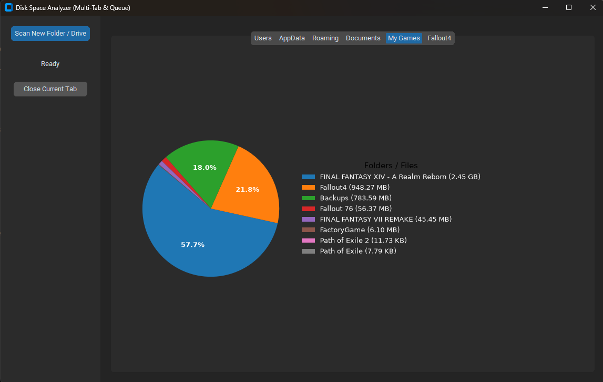

# Disk Space Analyzer



A fast, interactive, and modern desktop application built with Python using **CustomTkinter** and **Matplotlib** to help you visualize and manage your storage space. 

This tool scans any selected drive or directory, displays the top 10 largest folders and files in a clean pie chart with an organized side legend, and allows you to dynamically "drill down" into subdirectories or locate items directly in Windows Explorer.

---

## Features

* **Windows Shell Integration:** Right-click directly on any folder, inside any directory background, or on any drive (e.g., `C:`, `D:`) in *This PC* to scan it instantly.
* **Interactive Visualization:** Uses an optimized Matplotlib pie chart coupled with a non-overlapping color-coded legend showing exact data sizes.
* **Drill-Down Navigation:** Click on any slice of the chart to open a menu allowing you to either scan further into that subfolder or open it directly in Windows Explorer.
* **Safe Termination:** Handles closing events gracefully. Background worker threads stop immediately upon exit, preventing memory leaks or application hangs.
* **Modern UI:** Styled using CustomTkinter with full system dark/light mode compatibility.

---

## Installation & Setup

Note on Windows Defender: Since this is an independent open-source project and not digitally signed with a costly commercial certificate, Windows SmartScreen might flag the installer during the first downloads. Click 'More Info' and then 'Run Anyway' to proceed with the installation. You can review the complete source code here on GitHub to verify its safety.

### Option 1: Using the Installer (Recommended for Users)
1. Run `DiskAnalyzer_Setup.exe`.
2. Follow the installation wizard. This will securely copy the application to your `Program Files` and automatically register the context menus.
3. To use, simply right-click any drive or folder in Windows and select **"Analyze Disk Space"**.
	(You can also run disk_analyzer.exe from your C:\Program Files (x86)\Disk Space Analyzer\)

### Option 2: Running from Source (For Developers)

#### Prerequisites
Make sure you have Python 3.10+ installed on your system.

#### 1. Clone the repository
```bash
git clone [https://github.com/Muphan/Disk-Space-Analyzer.git](https://github.com/Muphan/Disk-Space-Analyzer.git)
cd DiskSpaceAnalyzer